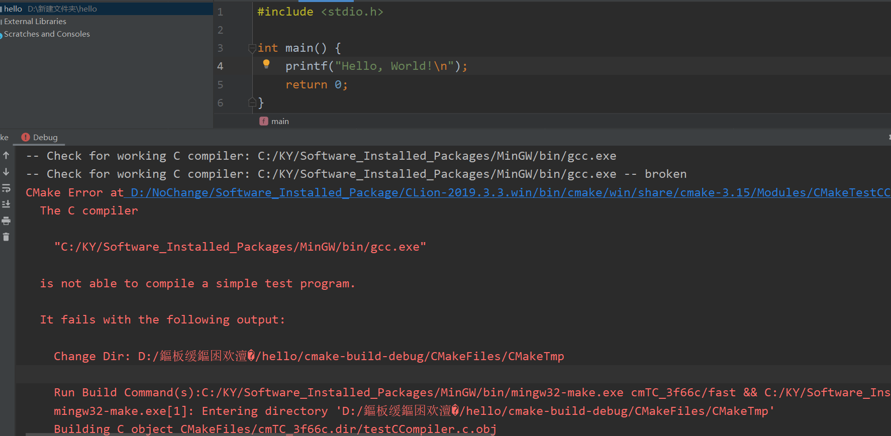
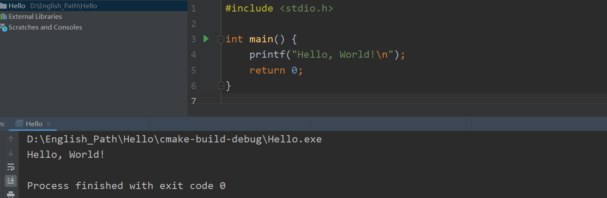
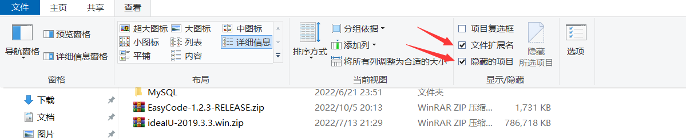

### 用户名推荐使用英文字符

Windows的用户名 与 用户文件夹 是一一映射的关系。

第一次设置用户名时，用户文件夹名 和 用户名 是一样的。

后续，我们修改 用户名，用户文件夹名不会再次被修改。

使用 英文字符 与 不使用英文字符的区别：

- 当一个路径下存在中文字符时，程序可能无法正常识别。
  - 该情况常常发生在编程上。

如果存在使用了中文路径，在CLion中，会进行如下报错。

如果使用英文字符，不出现任何报错。

### 磁盘分区

在Windows中，更加推荐将 存放系统的盘符 与 用户实际存放的数据文件 进行分开。

- 这方便用户转移数据。

以Windows10为例，存放系统的盘符个人推荐保留 254GB。

### 显示文件扩展名、显示隐藏的文件

扩展名是一个文件的 `. ` 的后缀，它可以帮助操作系统去匹配合适的软件来打开该文件。

隐藏文件：常见的是 以 `.` 开头命名的文件。默认情况下，用户是无法看到该文件的。

