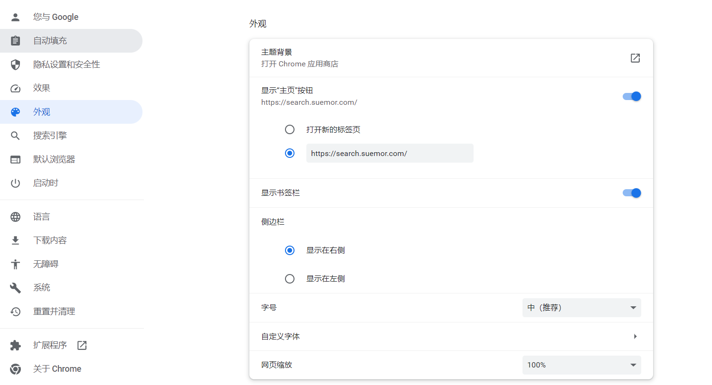
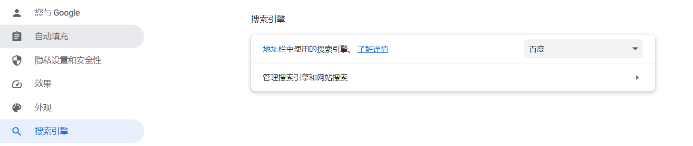
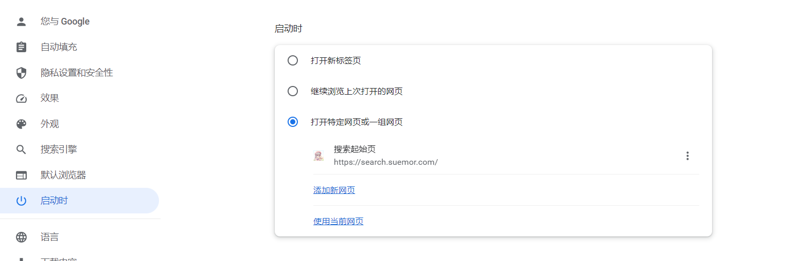
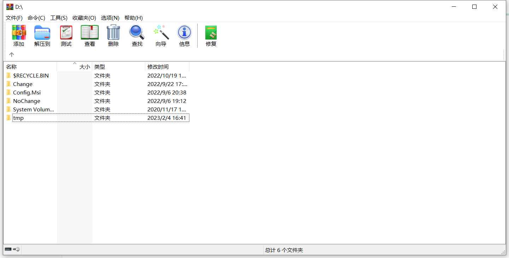
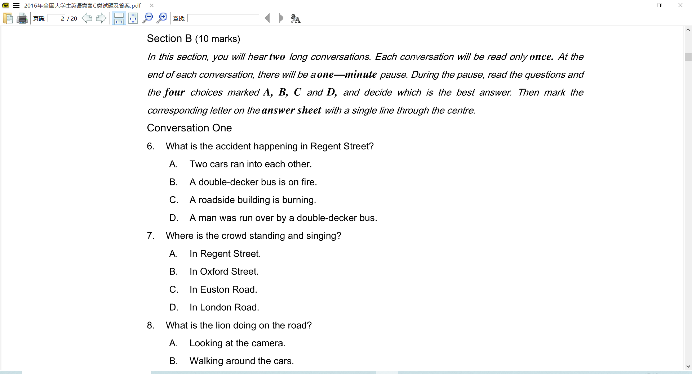
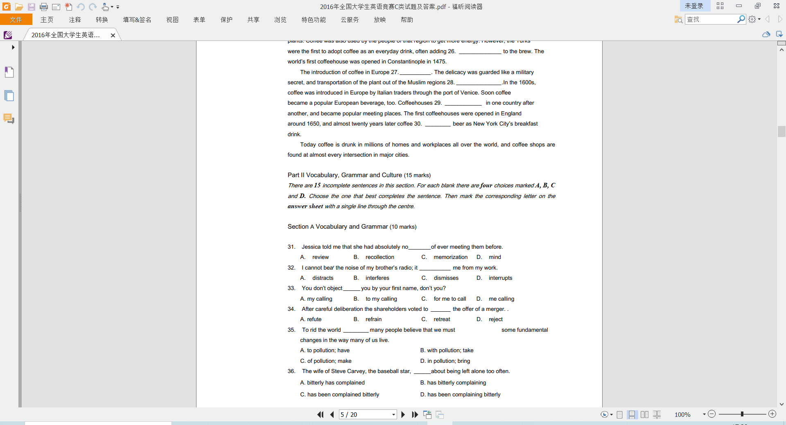
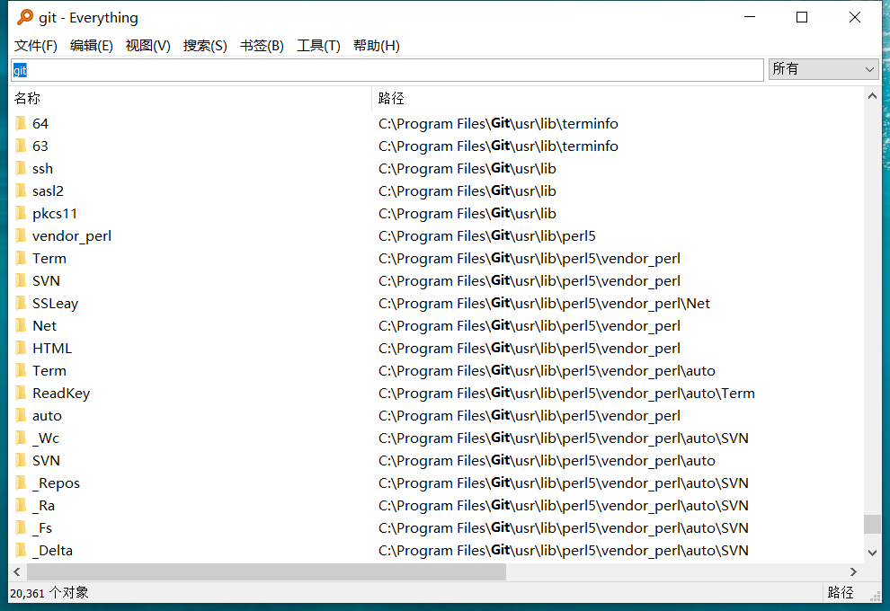

第一次使用Windows操作系统，内置的软件往往是无法满足用户的实际需求的。

通常，会把一些常用的软件进行分类、列举。

- 用户可以根据自己的需要选择是否下载、安装、使用。
- 以下软件不可能完全符合用户的实际需求，请根据实际情况自行考虑是否采纳。

以下出现的软件的仅代表个人喜好，并非排斥某个公司的软件。

- 你可以根据自己的个人喜好来进行选择。

### 浏览器

#### Google Chrome

谷歌推出的一款浏览器，软件打开速度快，使用 Chromium 内核，渲染网页速度快。

官网：https://www.google.cn/intl/zh-CN/chrome/

需要进行配置的地方

- 显示 “主页” 按钮、显示书签栏
- 修改 搜索引擎
- 修改 启动时 的选项
- 设置为 默认的浏览器

### 视频

对于国内来说，看视频选择的主要平台是 腾讯视频、爱奇艺、Bilibili。

它们都有相应的Windows版本的软件。但我不推荐 直接下载它们的软件。

在Windows上，更加推荐 保存它们的链接 到 浏览器的书签。（直接在浏览器上看视频）

### 音乐

与 视频 一样，也是推荐 在浏览器中听音乐。

当然，也许你无法接受这种方式。

也可以下载 网易云音乐 或者 酷狗音乐。

- 网易云官网：https://music.163.com/
- 酷狗官网：https://www.kugou.com/

### 解压缩

压缩包是我们在使用计算机中，经常遇到的文件。

- 压缩包是 将多个文件、文件夹 压缩成 一个文件，方便在互联网中进行传输的一种方式。

压缩包的常见格式如：rar、zip、7z

#### WinRar

WinRar是1993推出的一款解压缩软件。

它的免费版主要面向个人用户，会有广告弹出。

如果购买它的商用版，就不会有广告了。

官网：https://www.win-rar.com/

#### Bandizip

它是在2014年发布的。

它是一个强大的多功能压缩文件管理工具，可提供很快的解压缩速度和其他各种实用功能。

 这是一个免费的软件，其付费版本更是可以使用更多的实用功能。

官网：https://www.bandisoft.com/bandizip/

### 沟通

#### QQ

腾讯旗下的一款社交软件。

官网：https://im.qq.com/

#### 微信（Wechat）

腾讯旗下的一款社交软件。

官网：https://weixin.qq.com/

### 办公

在Windows中，内置了Office套件，它主要包含 Word、Excel、PowerPoint，常被叫做 “办公三件套”。

#### WPS

WPS是金山公司的一款办公产品。

相较于 微软的Office套件，它更加适合国人的使用。

官网：https://www.wps.cn/

#### SumatraPDF

它可以更快的打开PDF文件，完全免费。

官网：https://www.sumatrapdfreader.org/free-pdf-reader

#### 福晰阅读器

与 SumatraPDF 一样，是一款 PDF阅读器。

官网：https://www.foxitsoftware.cn/

### 网盘

#### 百度网盘

官网：https://pan.baidu.com/

### 视频播放器

#### PotPlayer

PotPlayer 是 Daum 公司的一款网络播放器。

支持多语言版本、记忆播放、大部分视频格式编解码。

使用该软件，最好学习它的一些快捷键，方便你去使用。

官网：http://potplayer.tv/?lang=zh_CN

### 查找文件

#### everything

它是 Windows 上一款搜索引擎，它能够基于文件名快速定文件和文件夹位置。

不像 Windows 内置搜索，它默认显示电脑上每个文件和文件夹。

您在搜索框输入的关键词将会筛选显示的文件和文件夹。

中文官网：https://www.voidtools.com/zh-cn/

