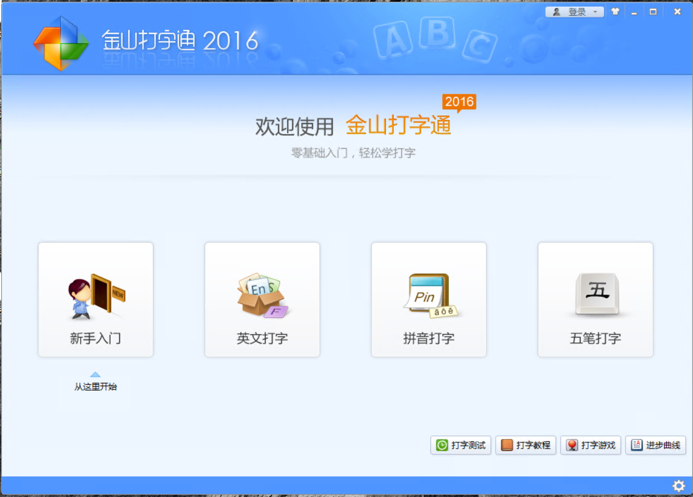
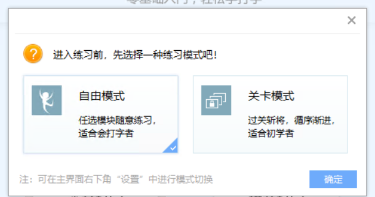
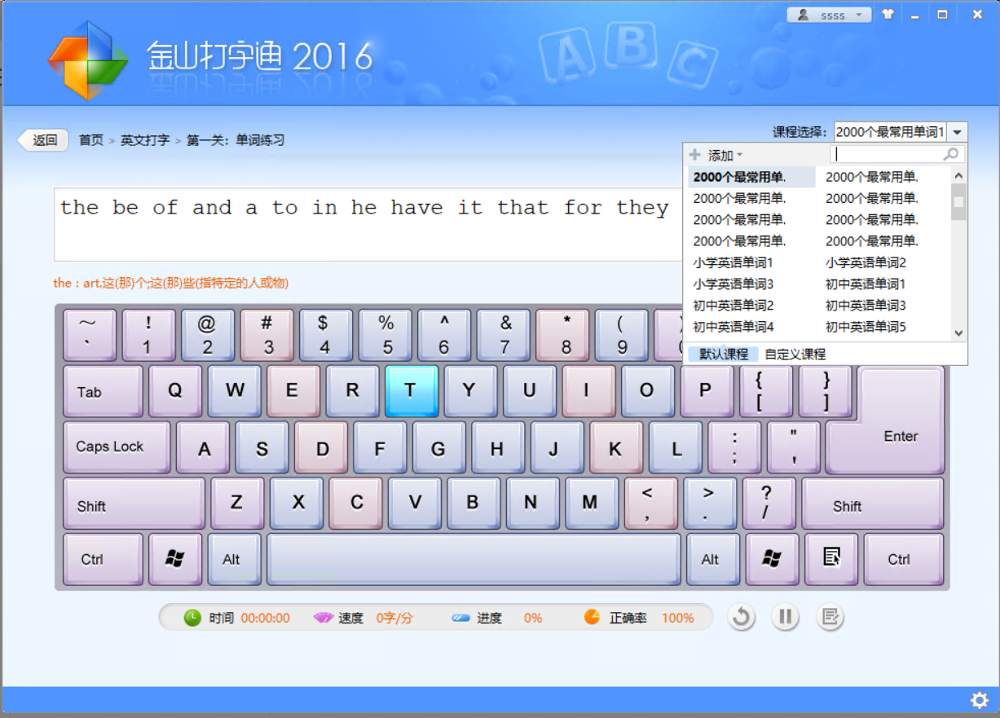
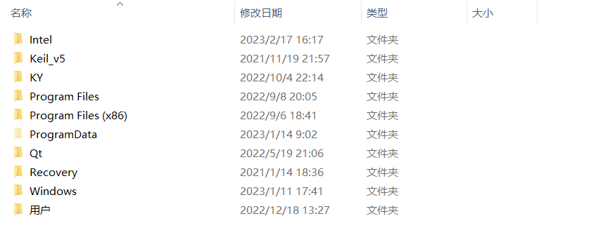
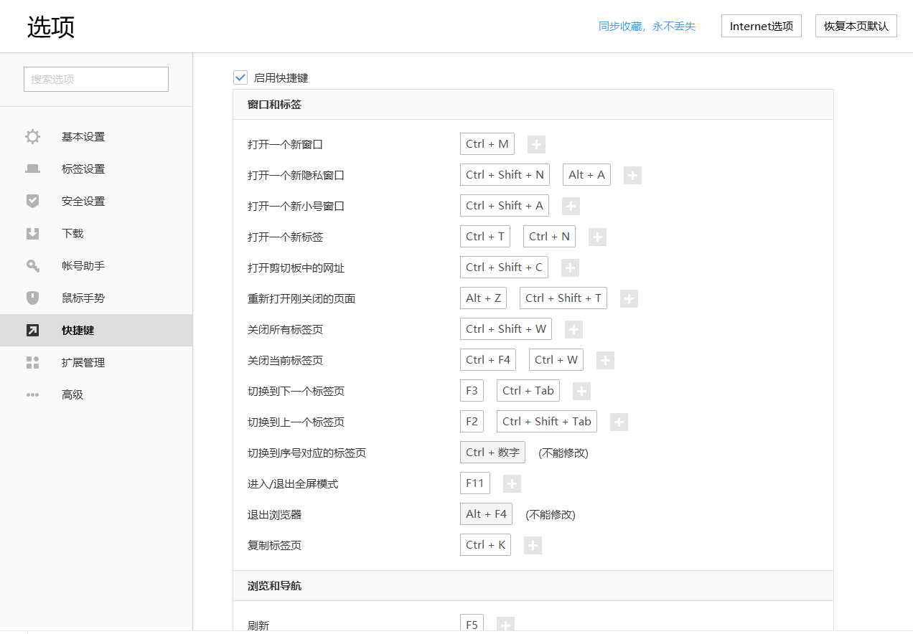

## 打字

使用计算机需要掌握的一个技能。

推荐下载 **金山打字通** 进行练习。

- 官网：https://www.51dzt.com/rubik/?_position=51dzt

在进行 登录时，选择 **自由模式**。

我们从软件中可以看到，金山打字通 分为四个模块：新手入门、英文打字、拼音打字、五笔打字。

- 新手入门：初学者需要仔细去学习的模块。它包含了打字时要注意的很多细节。
- 练习
  - 英文打字
    - 键盘的 英文字符按键 与 英文的字符 是一一对应的。
    - 世界上，以英语作为主要语言的国家中，能很好的使用计算机键盘。
      - 这也表明了，掌握 英文打字。可以说，基本上，你已经掌握了 打字 的这一门技能。
  - 拼音打字
    - 通过拼音来 匹配 中文字符。
    - 与 英语字符按键 不是一一对应的关系。
    - 不需要刻意去练习，只要你 会拼音。
    - 如果你不会拼音，拼音打字 你是不可能掌握的。（这不是练习的问题）
  - 五笔打字
    - 自从拼音打字出来后，很少见有人使用。
    - 可以不去掌握。不影响

在使用该软件时，只需要练习：新手入门、英文打字 这两个模块即可。

在英文打字练习中，可以 进行 打字内容的切换。

## 软件

在使用计算机中，我们需要使用到很多下载的软件。

用户经历的过程包含：下载、安装、设置、使用。

下载

- 尽量在官方网站中进行下载
  - 如果你在非官方网站中进行下载，可以通过 文件大小、MD5值对比 来判断。

安装

- 很多软件的安装是 傻瓜式的。
  - 你可能纠结的是安装的位置。不同的人可能采取不同的做法。
    - 比如：某些人会将自己下载的软件安装到 它自己指定的位置。
      - 但是，如果对于每个软件，都采取这种策略，这无疑是加重了自己的负担。
    - 如果说，你工作中使用到一类特定的软件，可以将 它存放到指定的位置。
      - 如果是游戏类的软件，也推荐存放到指定的位置。（因为它占用的空间比较大）
      - 其它的软件，采取默认的安装位置即可。

设置

- 在使用软件前，需要对软件进行一定的设置。
  - 为了让软件正常工作。
  - 在音视频下载的软件中，可能是为了指定下载位置、缓存位置。
  - 关闭默认的广告
  - 关闭软件的开机自启动
  - 个性化设置
- 对软件进行设置是一件很要必要的事。

## 文件分类

正如一开始提到，存放系统的盘符 与 用户需要保存数据的文件（存放到另外一个盘符） 进行分开。

- 它方便用户后面 进行数据转移。

了解Windows的文件分类。（以系统盘为例）

文件夹 Keil_v5、KY、Qt 是个人创建的文件夹，默认是不存在。（忽略即可）

Program Files文件夹：它包含了所有安装在系统上的应用程序，它们是系统安装和运行的必要文件。

Program Files(X86)文件夹：与 Program Files文件夹 功能一致

- Program Files(X86)文件夹 存放的是 32位的软件。而 Program Files文件夹 存放的是 64位的软件。
- 它们只是在默认的安装位置上进行了区分（不是强制的措施）。

ProgramData文件夹：这是系统的全局文件夹，它包含了所有安装在系统上的应用程序的全局数据，如配置文件、许可证文件等

Windows文件夹：这是系统的主文件夹，它包含了系统的核心文件，如系统配置文件、系统图标、系统壁纸等

User文件夹：这是用户文件夹，它包含了用户的文档、图片、音乐、视频等文件

在存放用户数据的盘符，可以根据自己的实际情况，定义自己的文件组织结构，不存在严格意义上的标准。

举例：

~~~ txt
D:.
└─Software_Data_Package
│   ├─Baidu download
│   ├─Sougou Download
└─Software_Installed_Package
└─Resource
│   └─光盘文件
│   └─图片
│   └─系统
│   └─视频
│   └─软件
│   └─音乐
~~~

## 快捷键

它又被叫作 快速键 或 热键，指通过某些特定的按键、按键顺序或按键组合来完成一个操作。

很多快捷键往往与如 Ctrl 键、Shift 键、Alt 键、Fn 键、 Windows 键等配合使用。

快捷键分为 通用的 和 专用的。大部分的快捷键在设计时，趋向于减少用户的学习成本。

链接：https://baike.baidu.com/item/%E5%BF%AB%E6%8D%B7%E9%94%AE

软件本身的快捷键【比如：搜狗浏览器】

